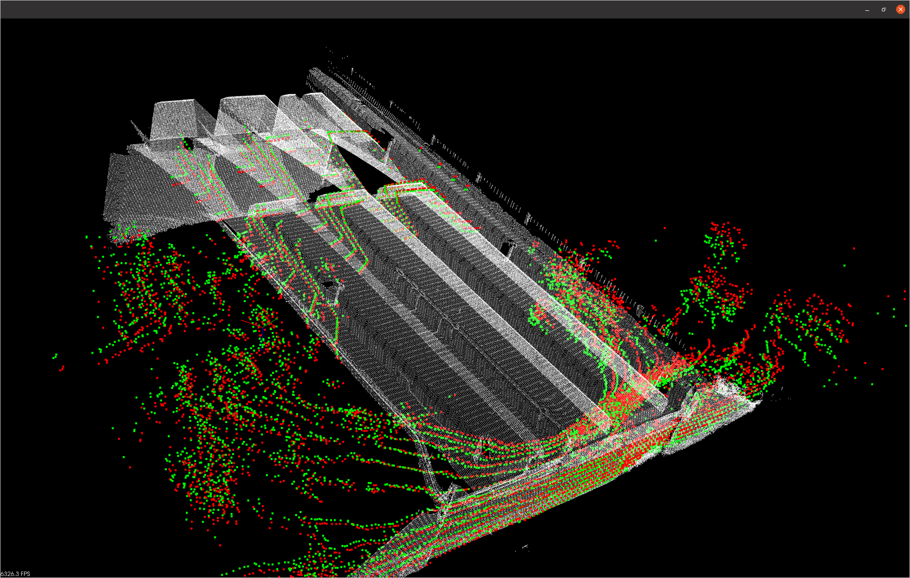

# Scan Pose Ground Truth Generation

## Goal 

The goal of this repo is to create a tool for automatically generating ground truth (GT) pose of a lidar given an initial estimated trajectory and a high quality ground truth map (usually generated with a TLS such as Faro or Leica Scanner)

We also provide a visualizer to view results, and crop down the output trajectory to only successful results

## Dependencies

* OpenMP
* Libbeam

For instructions for installing libbeam, see [here](https://github.com/BEAMRobotics/libbeam)

## Installing

```
cd ~/code_path/scan_pose_gt_generation
mkdir build
cd build
cmake ..
make -j4
```

## Tutorial

This tutorial will run though generating GT with an example

(1) download the two example files from [this link](https://drive.google.com/drive/folders/1bAhRpu_As0sGS_tI8mjO6d2NTeJn8nDz?usp=share_link) and save to ~/example_data
(2) run the GT generation binary using the data/configs in the repo:

```
cd ~/code_path/scan_pose_gt_generation/build

./scan_pose_gt_generation_run_gt_generation \
-bag_file ~/example_data/example_data.bag \
-gt_cloud ~/example_data/faro_scan_example.pcd \
-config ~/code_path/scan_pose_gt_generation/config/config_example.json \
-extrinsics ~/code_path/scan_pose_gt_generation/config/extrinsics_example.json \
-gt_cloud_pose ~/code_path/scan_pose_gt_generation/config/T_World_GtCloud_example.json \
-initial_trajectory ~/code_path/scan_pose_gt_generation/config/initial_trajectory_example.json \
-output_directory ~/example_data/ \
-topic /lidar_h/velodyne_packets_unpacked \
-visualize=false

```

Setting visualize to true will open up a viewer as shown below:



When the binary is complete, you should see the following outputs


To visualize the final result and filter failed submaps, run:

```
./scan_pose_gt_generation_results_visualizer -input_directory ~/example_data/DATE/
```

A visualizer should open up looking like this:


### Inputs
(1) GT Cloud: pointcloud .pcd format that we will use to register our lidar scans against. See example file [faro_scan_example.pcd](https://drive.google.com/drive/folders/1bAhRpu_As0sGS_tI8mjO6d2NTeJn8nDz?usp=share_link) \
(2) Initial Trajectory: initial estimate of the scan trajectory. This can contain poses in any frame as long as the frame is present in the extrinsics file. See example file: initial_trajectory_example.json. A trajectory file matching this format can be created using one of the binaries in [3d_map_builder](https://github.com/nickcharron/3d_map_builder)\
(3) GT Cloud Pose: transform from the GT cloud's frame to the world frame (T_World_GtCloud), or the fixed frame in the initial poses. This can be generated by aligning the GT Cloud to a map generated with the intial estimated poses. This can be done easily in CloudCompare. See example file: T_World_GtCloud_example.json \
(4) Extrinsics: estrinsic calibrations json file. Only needed if the scan is not in the same frame as the poses. See example: extrinsics_example.json \
(5) data.bag: a bag containing raw lidar data. See example file [example_data.bag](https://drive.google.com/drive/folders/1bAhRpu_As0sGS_tI8mjO6d2NTeJn8nDz?usp=share_link) \
(6) topic: topic of the lidar data to generate GT \
(7) config: see example config files

## Methodology

The general methodology is as follows:

* load GT cloud, apply filters, transform into map frame
* load scan, apply filters, then extract loam points
* transform scan into estimated map frame using initial trajectory
* register scan to map, add to a trajectory list
* continue adding scans until you reach a max trajectory length
* fit spline to trajectory
* re-register scans using spline trajectory as initial pose estimate, this time register all points (not just loam)
* fit refined poses to spline, then calculate the average error between the initial trajectory and the new alignment
* use average initial trajectory error to correct initial poses for the following trajectory
